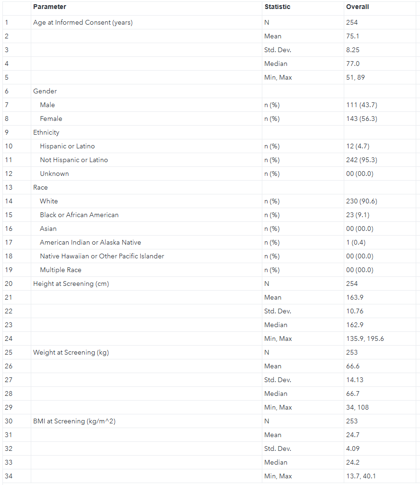

# Demographics Table Generation (SAS)

This project simulates a real-world clinical SAS programming task focused on generating a demographics table from ADSL data.
This project was developed as part of my transition into SAS programming after completing formal training.

## Overview
The goal of this project is to reproduce a standard demographics table using SAS and ADSL dataset.

## Dataset
- ADSL (Analysis Dataset)
- Safety Population (SAFFL = "Y")

## Methods
- DATA step for data preparation
- PROC MEANS for continuous variables (age, height, weight, BMI)
- PROC FREQ for categorical variables (sex, ethnicity, race)
- PROC TRANSPOSE for reshaping data
- User-defined formats and informats
- SAS macros for reusable processing

## Key Features
- Creation of dummy table structure to preserve row order
- Handling of missing categories
- Section-based table generation logic
- Structured final dataset ready for reporting

## Output
Final dataset representing demographics table with:
- Age statistics
- Gender distribution
- Ethnicity and race
- Height, weight, BMI

## Example Output

## Author
Mkrtich Ghazarosyan
